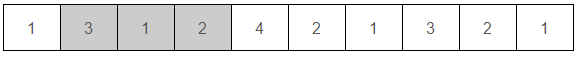

# 중복없는 구간

### 문제

----------

n개의 숫자가 주어지고, 이 중에서 r개의 연속된 숫자를 선택했을 때, 이 연속 부분 내에는 숫자가 중복되지 않기를 원한다. 예를 들어, 다음과 같이 10개의 숫자에서 3개의 연속된 숫자를 선택할 수 있다.



이렇게 선택을 하면, 선택된 숫자들 사이에서는 중복이 존재하지 않는다. r의 최댓값을 구하는 프로그램을 작성하시오. 위의 경우, (4, 2, 1, 3)을 선택하면 되므로 r의 최댓값은 4이다. r이 5 이상이 될 경우, 중복 없이 연속 부분을 선택하는 것이 불가능하다.

### 입력

----------

첫째 줄에는 숫자의 개수 n이 주어진다. ( 1 ≤ n ≤ 100,000 ) 둘째 줄에 n개의 숫자가 주어진다. 각 숫자는 항상 1보다 크거나 같고, n보다 작거나 같다.

### 출력

----------

r의 최댓값을 출력한다.

### 예제 입력

```
10
1 3 1 2 4 2 1 3 2 1
```

### 예제 출력

```
4
```

### 예제 입력

```
7
7 1 4 2 5 3 6
```

### 예제 출력

```
7
```

### 코드

```java
import java.util.Scanner;
import java.util.Arrays;
public class Main{
    public static void main(String[] args){

      // Please Enter Your Code Here
      Scanner sc = new Scanner(System.in);
      int n = Integer.parseInt(sc.nextLine());
      String arr[] = sc.nextLine().split(" ");
      int num[] = new int[arr.length];
      for(int i=0; i<arr.length; i++){
        num[i] = Integer.parseInt(arr[i]);
      }
      
      System.out.println(getMaxR(n, num));
      
    }
    
    public static int getMaxR(int n, int arr[]){
      
      int temp[] = new int[n];
      temp[0] = arr[0];
      int sp = 0;
      int maxR = 1;
      int tp = 1;
      
      for(int i=1; i<n; i++){
        // Arrays.sort(temp);
        //int pos = binarySearch(temp,sp,i-1,arr[i]);
        int pos = -1;
        
        for(int j=sp; j<i; j++){//중복 탐색;
          if(temp[j] == arr[i]){ pos = j; break; }
        }
        
        if(pos < 0){//중복x
          temp[tp++] = arr[i];
          int cnt = i-sp+1;
          // System.out.println(i+"cnt: "+cnt+" ");
          if(maxR < cnt){ maxR = cnt; }
        }else{ //중복인경우- pos+1지점부터 다시 연결
          sp = pos+1;
          // System.out.println(i+"sp: "+sp+" ");
          temp[tp++] = arr[i];
        }
        if(i==11){
          // System.out.println(pos);
          // System.out.println(Arrays.toString(temp));
        }
      } // for end
      
      return maxR;
    }

    public static int binarySearch(int arr[], int start, int end, int value){
      
      if(start > end){
        return -1;
      }
      else if(start == end){
        if(arr[start] == value) return start;
        else return -1;
      }
      else{
        int mid = (start+end)/2;
        if(arr[mid] == value){ return mid; }
        else if(arr[mid] > value) return binarySearch(arr, start, mid-1, value);
        else return binarySearch(arr, mid+1, end, value);
      }
    }    
    
}
```