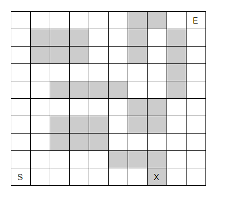

# Level 19

# 목수의 미로 탈출

### 문제

----------

아래와 같이 이동할 수 있는 길, 그리고 이동할 수 없는 벽으로 이루어진 크기 N x M 의 지도가 주어진다. 이 때, (N-1, 0) 에서 출발하여 (0, M-1) 까지 도착하는 최단거리를 찾으려 한다. 그런데 목수는 도끼 하나를 갖고 있으며, 이 도끼를 이용하여 벽을 깨부술 수 있다. 하지만 이 도끼는 내구성이 그렇게 좋지 않기 때문에, 벽을 최대 1개밖에 깰 수 없다. 목수가 출발점에서 도착점까지 이동하기 위한 최단거리를 출력하는 프로그램을 작성하시오. 물론, 벽은 최대 1개까지 깰 수 있다. 아래 예제의 경우 ‘X’ 로 표시된 벽을 깰 경우 거리 18만에 출발점에서 도착점으로 이동할 수 있다.



### 입력

----------

첫째 줄에 지도의 세로 길이 N과 지도의 가로 길이 M이 주어진다. ( 1 ≤ N, M ≤ 1,000 ) 둘째 줄부터 지도의 정보가 주어진다. 0은 이동할 수 있는 부분, 1은 이동할 수 없는 부분을 나타낸다.

### 출력

----------

목수가 (N-1, 0) 에서 출발하여 (0, M-1) 까지 이동하는 데 필요한 최단거리를 출력한다. 목수는 미로를 항상 탈출할 수 있다고 가정한다.

### 예제 입력

```
10 10
0 0 0 0 0 0 1 1 0 0
0 1 1 1 0 0 1 0 1 0 
0 1 1 1 0 0 1 0 1 0
0 0 0 0 0 0 0 0 1 0
0 0 1 1 1 1 0 0 1 0
0 0 0 0 0 0 1 1 0 0
0 0 1 1 1 0 1 1 0 0
0 0 1 1 1 0 0 0 0 0 
0 0 0 0 0 1 1 1 0 0
0 0 0 0 0 0 0 1 0 0
```

### 예제 출력

```
18
```

### 예제 입력

```
10 10
0 0 0 0 0 0 1 1 0 0
0 1 1 1 0 0 1 1 1 0
0 1 1 1 0 0 1 1 1 0
0 0 0 0 0 0 0 1 1 0
0 0 1 1 1 1 0 1 1 0
0 0 0 0 0 0 1 1 0 0
0 0 1 1 1 0 1 1 0 0
0 0 1 1 1 0 0 1 0 0
0 0 0 0 0 1 1 1 1 1
0 0 0 0 0 0 0 1 0 0
```

### 예제 출력

```
22
```


### 코드

```java
import java.util.Scanner;
import java.util.Queue;
import java.util.LinkedList;

public class Main{
    
    public static void main(String[] args){

      // Please Enter Your Code Here
      Scanner sc = new Scanner(System.in);
      int n = sc.nextInt();
      int m = sc.nextInt();
      
      //set map
      int map[][] = new int[n][m];
      for(int i=0; i<n; i++){
        for(int j=0; j<m; j++){
          map[i][j] = sc.nextInt();
        } // for j end
      }//for i end
      
      BFS(map, n, m);
    }

    public static void BFS(int map[][], int n, int m){
      
      int step[][] = new int[n][m];
      int step2[][] = new int[n][m];
      
      //S(n-1, 0)
      //E(0, m-1)
      
      fillStep(n,m,n-1,0,map,step);
      fillReverseStep(n,m,0,m-1,map,step,step2);
      
    } // BFS END   
    
    public static void fillStep(int n, int m, int si, int sj, int map[][], int step[][]){
      //너비 우선 탐색
      Queue<Integer> q = new LinkedList<Integer>(); //원형큐      
      
      //BFS는 큐에 초기값 설정후 진행!
      q.offer(si);
      q.offer(sj);
      
      while(!q.isEmpty()){ 
        //1. 큐에서 방문할 정점을 뺀다
        int i = q.poll();
        int j = q.poll();
        int now_step = step[i][j];
        
        //위쪽
        int up_i = i-1;
        int up_j = j;
        
        //오른쪽
        int right_i = i;
        int right_j = j+1;
        
        //아래쪽
        int down_i = i+1;
        int down_j = j;

        //왼쪽
        int left_i = i;
        int left_j = j-1;
        
        //2. 이동가능한 블럭인지 확인
        //   이미체크된 블럭인지 확인
        //   스텝저장(=방문체크) + 큐에 입력
        //위쪽
        if(up_i >= 0 && step[up_i][up_j] == 0){
          if(map[up_i][up_j] == 0){
            step[up_i][up_j] = now_step+1;
            q.offer(up_i);
            q.offer(up_j);              
          }
          
        }
        
        //오른쪽
        if(right_j < m && map[right_i][right_j] == 0 && step[right_i][right_j] == 0){
          step[right_i][right_j] = now_step+1;
          q.offer(right_i);
          q.offer(right_j);
        }
        
        //아래쪽
        if(down_i < n && map[down_i][down_j] == 0 && step[down_i][down_j] == 0){
          step[down_i][down_j] = now_step+1;
          q.offer(down_i);
          q.offer(down_j);
        }
        
        //왼쪽
        if(left_j >= 0 && map[left_i][left_j] == 0 && step[left_i][left_j] == 0){
          step[left_i][left_j] = now_step+1;
          q.offer(left_i);
          q.offer(left_j);
        }        
        
      }// 3. 큐가 빈상태일때까지 반복한다.      
      
      step[si][sj] = 0;
    }

    public static void fillReverseStep(int n, int m, int si, int sj, int map[][], int step_helper[][], int step[][]){
      //너비 우선 탐색
      Queue<Integer> q = new LinkedList<Integer>(); //원형큐      
      
      //BFS는 큐에 초기값 설정후 진행!
      //Start
      q.offer(si);
      q.offer(sj);
      
      int res = 999999999;
      
      while(!q.isEmpty()){ 
        //1. 큐에서 방문할 정점을 뺀다
        int i = q.poll();
        int j = q.poll();
        int now_step = step[i][j];
        
        //위쪽
        int up_i = i-1;
        int up_j = j;
        
        //오른쪽
        int right_i = i;
        int right_j = j+1;
        
        //아래쪽
        int down_i = i+1;
        int down_j = j;

        //왼쪽
        int left_i = i;
        int left_j = j-1;

        //원래 벽인데 들어온 경우
        if(map[i][j] == 1){
          //주변에 helper가 있는지 확인 하고 res가 최소화
          //상
          if(up_i >= 0 && step_helper[up_i][up_j] != 0){
            if(step_helper[up_i][up_j] + now_step < res){ res =  step_helper[up_i][up_j] + now_step; }
          }
          //하
          if(down_i < n && step_helper[down_i][down_j] != 0){
            if(step_helper[down_i][down_j] + now_step < res){ res =  step_helper[down_i][down_j] + now_step; }
          }
          //좌
          if(left_j >= 0 && step_helper[left_i][left_j] != 0){
            if(step_helper[left_i][left_j] + now_step < res){ res =  step_helper[left_i][left_j] + now_step; }
          }
          //우
          if(right_j < m && step_helper[right_i][right_j] != 0){
            if(step_helper[right_i][right_j] + now_step < res){ res =  step_helper[right_i][right_j] + now_step; }          
          }
          continue;
        }

        //벽상관없이 큐에 넣는다.
        //단, 위쪽에서 벽인경우에 Helper + 역스텝으로
        //최소값을 확인한다.
        //위쪽
        if(up_i >= 0 && step[up_i][up_j] == 0){
          step[up_i][up_j] = now_step+1;
          q.offer(up_i);
          q.offer(up_j);              
        }
        
        //오른쪽
        if(right_j < m && step[right_i][right_j] == 0){
          step[right_i][right_j] = now_step+1;
          q.offer(right_i);
          q.offer(right_j);
        }
        
        //아래쪽
        if(down_i < n && step[down_i][down_j] == 0){
          step[down_i][down_j] = now_step+1;
          q.offer(down_i);
          q.offer(down_j);
        }
        
        //왼쪽
        if(left_j >= 0 && step[left_i][left_j] == 0){
          step[left_i][left_j] = now_step+1;
          q.offer(left_i);
          q.offer(left_j);
        }        
        
      }// 3. 큐가 빈상태일때까지 반복한다.      
      
      System.out.println(res+1);
    }    
    
}
```