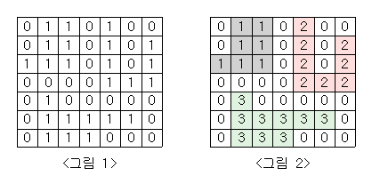

# 단지 번호 붙이기

<br>

### 문제

----------

<그림 1>과 같이 정사각형 모양의 지도가 있다. 1은 집이 있는 곳을, 0은 집이 없는 곳을 나타낸다. 철수는 이 지도를 가지고 연결된 집들의 모임인 단지를 정의하고, 단지에 번호를 붙이려 한다. 여기서 연결되었다는 것은 어떤 집이 좌우, 혹은 아래위로 다른 집이 있는 경우를 말한다. 대각선상에 집이 있는 경우는 연결된 것이 아니다. <그림 2>는 <그림 1>을 단지별로 번호를 붙인 것이다. 지도를 입력하여 단지수를 출력하고, 각 단지에 속하는 집의 수를 오름차순으로 정렬하여 출력하는 프로그램을 작성하시오.



### 입력

----------

첫 번째 줄에는 지도의 크기 N(정사각형이므로 가로와 세로의 크기는 같으며 5≤N≤25)이 입력되고, 그 다음 N줄에는 각각 N개의 자료(0혹은 1)가 입력된다.

### 출력

----------

첫 번째 줄에는 총 단지수를 출력하시오. 그리고 각 단지내 집의 수를 오름차순으로 정렬하여 한 줄에 하나씩 출력하시오.

### 예제 입력

```
7
0110100
0110101
1110101
0000111
0100000
0111110
0111000
```

### 예제 출력

```
3
7
8
9
```

### 출처

----------

KOI 1996 초등부 1번


### 코드

```java
import java.util.Scanner;
import java.util.Arrays;

public class Main{
    public static void main(String[] args){
      //PASS
      // Please Enter Your Code Here
      Scanner sc = new Scanner(System.in);
      int n = sc.nextInt();
      int map[][] = new int[n+2][n+2];
      
      sc.nextLine(); //remove 개행문
      
      //set map
      for(int i=1; i<=n; i++){
    	String input = sc.nextLine();    	
        for(int j=1; j<=n; j++) {
        	map[i][j] = Character.getNumericValue(input.charAt(j-1));        	
        }           
      }
      
      int group_num = 1;
      int group_len[] = new int[n*n];
      int group[][] = new int[n+2][n+2];
      //search map & mark group & count group_len
      for(int i=1; i<=n; i++){
        for(int j=1; j<=n; j++){
          if(group[i][j] == 0 && map[i][j] == 1){ //방문 안됬고 집이 있는 경우
            //단지를 형성하고 집갯수 반환받는다.
            group_len[group_num] = DFS(map,i, j, group, group_num, 0);
            group_num++;
          }
        }
      }      
      
      //solve
      System.out.println(group_num-1);
      Arrays.sort(group_len,1, group_num);
      for(int i=1; i<group_num; i++){
        System.out.println(group_len[i]);
      }
    }
    
    public static int DFS(int map[][], int i, int j, int group[][], int group_num, int cnt){
      
      //1. 나의 그룹을 표시 & 갯수 증가      
      cnt = cnt + 1;           
      group[i][j] = group_num;      
      //2. 나의 상,하,좌,우에 1이 있는지 확인
      //3.방문안됬고 집이 있으면
      //  DFS 시켜서 같은 단지 마킹하고 집갯수 업데이트    
      //  방문 정보가 업데이트 되야하므로 아래와 같이 상->하->좌->우 순으로 코드를 작성하는것이 중요!
      
      //상
      int up = map[i-1][j];
      int up_group = group[i-1][j];
      if(up_group == 0 && up == 1){ cnt = DFS(map,i-1,j, group, group_num, cnt); }
      //하
      int down = map[i+1][j];
      int down_group = group[i+1][j];
      if(down_group == 0 && down == 1){ cnt = DFS(map,i+1,j, group, group_num, cnt); }
      //좌
      int left = map[i][j-1];
      int left_group = group[i][j-1];
      if(left_group == 0 && left == 1){ cnt = DFS(map,i,j-1, group, group_num, cnt); }
      //우
      int right = map[i][j+1];
      int right_group = group[i][j+1];
      if(right_group == 0 && right == 1){ cnt = DFS(map,i,j+1, group, group_num, cnt); }      
                 
      
      return cnt; 
      
    }//DFS END    
}
```