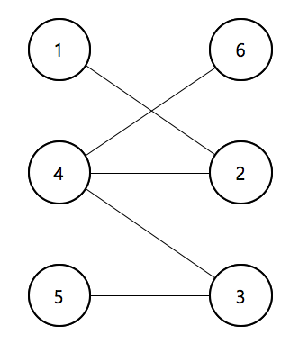

# 이분그래프 판별

<br>

### 문제

----------

이분 그래프란, 아래 그림과 같이 정점을 크게 두 집합으로 나눌 수 있는 그래프를 말한다. 여기서 같은 집합에 속한 정점끼리는 간선이 존재해서는 안된다. 예를 들어, 아래 그래프의 경우 정점을 크게 {1, 4, 5}, {2, 3, 6} 의 두 개의 집합으로 나누게 되면, 같은 집합에 속한 정점 사이에는 간선이 존재하지 않으므로 이분 그래프라고 할 수 있다.



그래프가 입력으로 주어질 때, 이 그래프가 이분그래프인지를 판별하는 프로그램을 작성하시오.

### 입력

----------

첫째 줄에 정점의 개수 N과 간선의 개수 M이 주어진다. ( 1 ≤ N ≤ 1,000, 1 ≤ M ≤ 100,000 ) 둘째 줄부터 간선의 정보가 주어진다. 각 줄은 두 개의 숫자 a, b로 이루어져 있으며, 이는 정점 a와 정점 b가 연결되어 있다는 의미이다.

### 출력

----------

주어진 그래프가 이분 그래프이면 Yes, 아니면 No를 출력한다.

### 예제 입력

```
6 5
1 2
2 4
3 4
3 5
4 6
```

### 예제 출력

```
Yes
```

### 예제 입력

```
4 5
1 2
1 3
1 4
2 4
3 4
```

### 예제 출력

```
No
```

### 코드

```java
import java.util.Scanner;
import java.util.Queue;
import java.util.LinkedList;

public class Main{
    //PASS
    public static final int V_MAX = 1010;
    public static final int MAX = 1010;
  
    public static void main(String[] args){

       // Please Enter Your Code Here
      Scanner sc = new Scanner(System.in);
      int v = sc.nextInt();
      int e = sc.nextInt();
      
      //make list(graph)
      int v_len[] = new int[V_MAX];
      int list[][] = new int[V_MAX][MAX];//graph
      int start_v = 0;
      
      //linking vertex
      for(int i=0; i<e; i++){
        int a = sc.nextInt();
        int b = sc.nextInt();
        
        if(i==0){ start_v = a; }
        
        list[a][v_len[a]++] = b;
        list[b][v_len[b]++] = a;
      }
      
      //solve
      System.out.println(BFS(list,v_len,start_v));
    }
    
    public static String BFS(int list[][], int v_len[], int start_v){
          
          String res = "Yes";
          
          //너비 우선 탐색
          //원형큐
          Queue<Integer> q = new LinkedList<Integer>(); 
          boolean checked[] = new boolean[V_MAX];
          boolean group[] = new boolean[V_MAX];
          // group : false 1번 그룹
          //       : true 2번 그룹
          
          
          //BFS는 큐에 초기값 설정후 진행!
          q.offer(start_v);
          checked[start_v] = true;
          group[start_v] = true;
          
          while(!q.isEmpty()){ // 4. 큐가 빈상태일때까지 반복한다.
          
            boolean isAble = true;
            //1. 큐에서 방문할 정점을 뺀다
            int v = q.poll();
            boolean v_group = group[v];
            //2. 나와 연결된 정점을 탐색한다.
            for(int i=0; i<v_len[v]; i++){
              int next = list[v][i];
              if(!checked[next]){
                //3. 큐에 입력되지 않은 정점을 모두 큐에 넣는다.
                q.offer(next);
                //4. 큐에 이미 입력되었음을 표시한다.
                checked[next] = true;
                //5. 해당 정점에 그룹을 설정한다.
                group[next] = !v_group;
              }else{
                //이미 방문된경우 들어가야할 그룹과
                //현재 배정되어 있는 그룹이 같은지 비교한다.
                //같지 않으면 불가능한 경우이므로 종료한다. 
                if(group[next] != !v_group){
                  isAble = false;
                  res = "No";
                  break;
                }
              }
            }//for END
            
            if(!isAble){ break; }
          }
          
          return res;
    } // BFS END   
    
}
```
