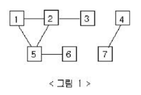

# 웜바이러스

<br>

### 문제

----------

신종 바이러스인 웜 바이러스는 네트워크를 통해 전파된다. 한 컴퓨터가 웜 바이러스에 걸리면 그 컴퓨터와 네트워크 상에서 연결되어 있는 모든 컴퓨터는 웜 바이러스에 걸리게 된다. 예를 들어 7대의 컴퓨터가 < 그림 1 > 과 같이 네트워크 상에서 연결되어 있다고 하자. 1번 컴퓨터가 웜 바이러스에 걸리면 웜 바이러스는 2번과 5번 컴퓨터를 거쳐 3번과 6번 컴퓨터까지 전파되어 2, 3, 5, 6 네 대의 컴퓨터는 웜 바이러스에 걸리게 된다. 하지만 4번과 7번 컴퓨터는 1번 컴퓨터와 네트워크 상에서 연결되어 있지 않기 때문에 영향을 받지 않는다.



어느날 1번 컴퓨터가 웜 바이러스에 걸렸다. 컴퓨터의 수와 네트워크 상에서 서로 연결되어 있는 정보가 주어질 때, 1번 컴퓨터를 통해 웜 바이러스에 걸리게 되는 컴퓨터의 수를 출력하는 프로그램을 작성하시오.

### 입력

----------

첫째 줄에는 컴퓨터의 수가 주어진다. 컴퓨터의 수는 100 이하이고 각 컴퓨터에는 1번부터 차례대로 번호가 매겨진다. 둘째 줄에는 네트워크상에서 직접 연결되어 있는 컴퓨터 쌍의 수가 주어진다. 이어서 그 수만큼 한 줄에 한 쌍씩 네트워크 상에서 직접 연결되어 있는 컴퓨터의 번호 쌍이 주어진다.

### 출력

----------

1번 컴퓨터가 웜 바이러스에 걸렸을 때, 1번 컴퓨터를 통해 웜 바이러스에 걸리게 되는 컴퓨터의 수를 첫째 줄에 출력한다.

### 예제 입력

```
7
6
1 2
2 3
1 5
5 2
5 6
4 7
```

### 예제 출력

```
4
```

### 출처
---
KOI 지역본선 2004 초등부 3번

###  코드

```java
import java.util.Scanner;
import java.util.Queue;
import java.util.LinkedList;

public class Main{
    //PASS
    public static final int V_MAX = 1010;
    public static final int MAX = 1010;
  
    public static void main(String[] args){

       // Please Enter Your Code Here
      Scanner sc = new Scanner(System.in);
      int v = sc.nextInt();
      int e = sc.nextInt();
      
      //make list(graph)
      int v_len[] = new int[V_MAX];
      int list[][] = new int[V_MAX][MAX];//graph
      
      //linking vertex
      for(int i=0; i<e; i++){
        int a = sc.nextInt();
        int b = sc.nextInt();
        
        list[a][v_len[a]++] = b;
        list[b][v_len[b]++] = a;
      }
      
      //solve
      System.out.println(BFS(list,v_len,1)-1);
    }
    
    public static int BFS(int list[][], int v_len[], int start_v){
          
          String res = "Yes";
          
          //너비 우선 탐색
          //원형큐
          Queue<Integer> q = new LinkedList<Integer>(); 
          boolean checked[] = new boolean[V_MAX];
          boolean group[] = new boolean[V_MAX];
          // group : false 1번 그룹
          //       : true 2번 그룹
          
          
          //BFS는 큐에 초기값 설정후 진행!
          q.offer(start_v);
          checked[start_v] = true;
          group[start_v] = true;
          
          int count = 0;
          while(!q.isEmpty()){ // 4. 큐가 빈상태일때까지 반복한다.
          
            boolean isAble = true;
            //1. 큐에서 방문할 정점을 뺀다
            int v = q.poll();
            count++;
            
            //2. 나와 연결된 정점을 탐색한다.
            for(int i=0; i<v_len[v]; i++){
              int next = list[v][i];
              if(!checked[next]){
                //3. 큐에 입력되지 않은 정점을 모두 큐에 넣는다.
                q.offer(next);
                //4. 큐에 이미 입력되었음을 표시한다.
                checked[next] = true;
              }
            }//for END
            
            if(!isAble){ break; }
          }
          
          return count;
    } // BFS END      
}
```