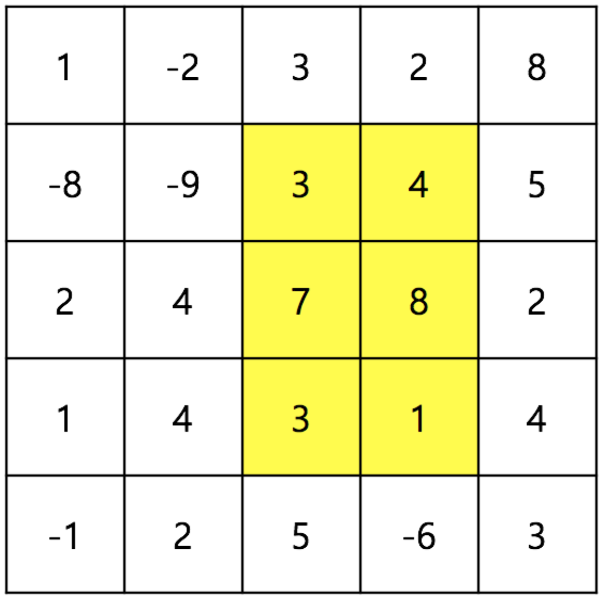

# 직사각형의 합   

<br>

### 문제
----------

N x M 의 직사각형이 주어지며, 각 칸에는 정수가 들어있다. 이제 Q개의 질문에 대하여 답을 해야 하며, 각각의 질문은 (a, b)부터 (c, d)까지의 직사각형에 들어있는 정수의 합을 묻는다. 예를 들어, 다음과 같이 5 x 5 의 직사각형이 주어질 때, (1, 2) 부터 (3, 3) 까지의 직사각형에 들어있는 정수의 합은 26 이다.

<p align="center">
  
</p>

### 입력
----------

첫 번째 줄에 N, M, Q가 주어진다. ( 1 ≤ N, M ≤ 1,000, 1 ≤ Q ≤ 1,000,000 ) 두 번째 줄부터 N x M 직사각형이 주어진다. 직사각형 안의 숫자 S는 -100이상 100이하이다. 그 후 Q개의 질문이 주어진다. 각각의 질문은 “a b c d” 로 이루어 져 있으며, 이는 (a, b) 부터 (c, d) 까지의 직사각형에 들어있는 정수의 합을 묻는다. (0 ≤ a ≤ c < N, 0 ≤ b ≤ d < M)

### 출력

----------
각 질문에 대한 답을 출력한다.


### 예제 입력

```
5 5 3
 1 -2 3 2 8
-8 -9 3 4 5
 2 4 7 8 2
 1 4 3 1 4
-1 2 5 -6 3
1 2 3 4
0 0 1 1
2 0 2 1
```

### 예제 출력

```
37
-18
6
```

### 코딩
 
```java
import java.util.Scanner;
public class Main{
    public static void main(String[] args){
      // PASS
      // Please Enter Your Code Here
      Scanner sc = new Scanner(System.in);
      
      //set n,m,q
      int n = sc.nextInt();
      int m = sc.nextInt();
      int q = sc.nextInt();
      
      //set square
      //점화식구할때 자신의 왼쪽, 오른쪽을 모두 사용하므로 배열의 크기를 조금 크게 잡는다.
      int square[][] = new int[n+2][m+2];
      int T[][] = new int[n+2][m+2];

      for(int i=1; i<=n; i++){
        for(int j=1; j<=m; j++){
          square[i][j] = sc.nextInt();
          T[i][j] = (T[i][j-1]-T[i-1][j-1]) + T[i-1][j] + square[i][j];
        }
      }
      
      
      //T(a,b,c,d) = T[c][d] - T[c][b-1] - T[a-1][d] + T[a-1][b-1];
      
      //solve query
      for(int i=0; i<q; i++){
        //set range -> a b c d
        int range[] = new int[4];
        for(int r=0; r<4; r++){
          range[r] = sc.nextInt();
        }
        //solve problem
        System.out.println(getSolve(range,T));
      }
      
    }
    
    
    public static int getSolve(int range[], int T[][]){
      //배열의 크기를 크게 잡았기 때문에 각 점에 +1을 해줘 질문의 의도에 맞춘다.
      int a = range[0]+1; int b = range[1]+1;
      int c = range[2]+1; int d = range[3]+1;
      
      return T[c][d] - T[c][b-1] - T[a-1][d] + T[a-1][b-1];
      
    }
}
```