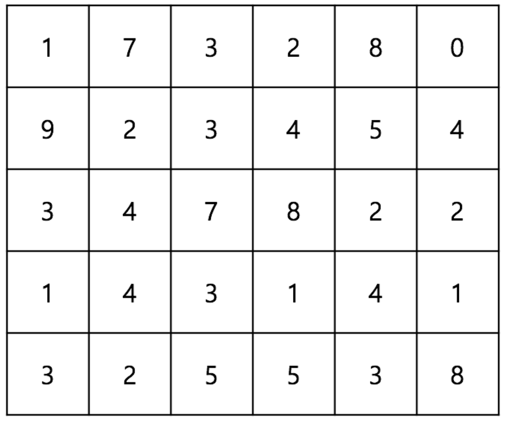

#  자원채취

<br>

### 문제

----------

N x M의 지도가 주어지며, 이 지도의 각 칸에는 자원이 존재한다. 자원의 양은 정수로 나타난다. 다음 그림은 5 x 6 의 지도에 존재하는 자원을 나타낸다.



철수는 자원을 채취하는 로봇을 갖고 있으며, 이 로봇은 (0, 0) 에서 출발하여 (N-1, M-1) 에서 자원 채취를 마친다. 로봇은 한가지 제약이 있는데, 오른쪽과 아랫쪽으로밖에 움직일 수 없다는 것이다. 이 로봇을 이용하여 가장 많이 채취할 수 있는 자원의 양을 출력하는 프로그램을 작성하시오. 위의 예제의 경우 다음과 같이 채취하는 것이 최대이며, 그 양은 49이다.


### 입력

----------

첫 번째 줄에 N, M이 주어진다. ( 1 ≤ N, M ≤ 1,000 ) 두 번째 줄부터 N x M 의 지도에 존재하는 자원의 양이 주어진다.

### 출력

----------

로봇을 이용하여 채취할 수 있는 자원의 양의 최댓값을 출력한다.

### 예제 입력

```
5 6
1 7 3 2 8 0
9 2 3 4 5 4
3 4 7 8 2 2
1 4 3 1 4 1
3 2 5 5 3 8
```

### 예제 출력

```
49
```

### 코드

```java
import java.util.Scanner;
public class Main{
    public static void main(String[] args){
      //PASS
      // Please Enter Your Code Here
      Scanner sc = new Scanner(System.in);
      int n = sc.nextInt();
      int m = sc.nextInt();
      
      // 점화식
      // T(i,j) = (0,0)부터 i,j까지 이동하면서 
      // 로봇이 채취할 수 있는 최대 자원의 양
      
      // 로봇은 아래쪽 또는 오른쪽으로 이동하기때문에
      // T(i-1 j)-위쪽, T(i,j-1)-왼쪽 중에서 큰 수를 선택
      // 한 값에 자기 자신의 자원의 값을 더해주면 됨!
      
      // T(i,j) = max(T(i-1 j), T(i,j-1)) + square(i,j)
      
      // N+1, M+1로 설정해서 i=1 일때와, j=1일때도 
      // 각각 위쪽 왼쪽 T를 사용할 수 있도록 설정
      // 주의! 대신 답을 출력할때 T[n][m]을 해줘야한다!
      
      int T[][] = new int[n+1][m+1];
      
      //Set T[][]
      for(int i=1; i<=n; i++){
        for(int j=1; j<=m; j++){
          T[i][j] = max(T,i,j) + sc.nextInt();
        }
      }
      
      //Solve
      System.out.println(T[n][m]);
    }
    
    public static int max(int T[][], int i, int j){
      if(T[i-1][j] >  T[i][j-1]){
        return T[i-1][j];
      }else{
        return T[i][j-1];
      }
    }
}
```