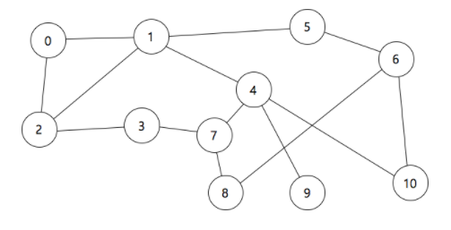

# 최단거리 

### 문제

----------

그래프와 출발점, 도착점이 주어질 때 출발점에서 도착점까지 이동하기 위한 최단거리를 출력하는 프로그램을 작성하시오. 예를 들어, 아래 그림에서 출발 정점이 0, 도착 정점이 10이라고 할 때, 최단거리는 3이다.



### 입력

----------

첫째 줄에 정점의 개수 N과 간선의 개수 M이 주어진다. ( 1 ≤ N ≤ 10,000, 1 ≤ M ≤ 1,000,000 ) 둘째 줄부터 간선의 정보가 주어진다. 각 줄은 두 개의 숫자 a, b로 이루어져 있으며, 이는 정점 a와 정점 b가 연결되어 있다는 의미이다. M+1 번째 줄에 대하여 출발점과 도착점의 정점 번호가 주어진다.

### 출력

----------

출발점에서 도착점까지 이동하기 위한 최단거리를 출력한다.

### 예제 입력

```
11 14
0 1
0 2
1 2
1 4
1 5
2 3
3 7
4 7
4 9
4 10
5 6
6 8
6 10
7 8
0 10
```

### 예제 출력

```
3
```

### 코드

```java
import java.util.Scanner;
import java.util.ArrayList;

public class Main{
    //PASS
    public static final int MAX = 5000;
  
    public static void main(String[] args){

      // Please Enter Your Code Here
      Scanner sc = new Scanner(System.in);
       
      int n = sc.nextInt();
      int m = sc.nextInt();

      ArrayList<ArrayList<Integer>> v = new ArrayList<ArrayList<Integer>>();
      
      for(int i=0; i<n; i++){
        ArrayList<Integer> arr = new ArrayList<Integer>();
        v.add(arr);
      }
      
      //set graph
      for(int i=0; i<m; i++){
        
        int a = sc.nextInt();
        int b = sc.nextInt();
        
        //linking
        v.get(a).add(b);
        v.get(b).add(a);
      }
       
      int start = sc.nextInt();
      int end = sc.nextInt();
      
      /* Link 확인
      for(int i=0; i<n; i++){
        ArrayList<Integer> arr = v.get(i);
        System.out.print(i+": ");
        for(int j=0; j<arr.size(); j++){
          System.out.print(arr.get(j)+" ");
        }
        System.out.println(" ");
      }
      */

      daijk(v, n, m, start, end);
    }
    
    public static void daijk(ArrayList<ArrayList<Integer>> v, int n, int m, int start, int end){
      
      //T[i]: start부터 i 정점까지의 최단거리
      int T[] = new int[n];
      //checked[i]: T[i]의 최단거리가 확정됬는지 판단해줌
      boolean checked[] = new boolean[n];
      
      //최단거리이기 때문에, 가장큰값으로 초기화
      for(int i=0; i<n; i++){
        T[i] = 999999999;
      }
      
      //T[start] 최단거리 0으로 세팅->왜? 시작점이므로 
      T[start] = 0;
      
      //각 정점을 순회하며 최단거리를 설정
      for(int i=0; i<n; i++){
        
        int min = 999999999; int min_idx = -1;
        
        //[질문]간선 가중치가 없을떄는 이 작업은 필요없지 않나?
        for(int j=0; j<n; j++){
          //아직 최단거리가 결정되지 않았고,
          //가장 작은 최소값을 갖는 정점을 추출해냄
          if(!checked[j] && T[j] < min){
            min = T[j];
            min_idx = j;
          }
        }//for j end
          
        //추출된 정점은 최단거리가 확정된 것임
        //왜? 모든 경로중에서 최단거리로 움직일 수 있는 정점이므로
        
        checked[min_idx] = true;
          
        //추출된(최단거리가 결정된) 정점에서 부터 뻗어나가면서
        for(int j=0; j < v.get(min_idx).size(); j++){
          int next_vertex = v.get(min_idx).get(j);
            
          //인접한 정점의 최소값을 update
          if(1 + min < T[next_vertex]){
            T[next_vertex] = 1 + min;
          }
        }//for j end
        
      }// for i end
      
      /* 정점 링크 + 가중치 확인용
      for(int i=0; i<n; i++){
        System.out.print(i+": ");
        String w_str = "";
        for(int j=0; j<v_len[i]; j++){
          System.out.print(v[i][j]+" ");
          w_str = w_str + w[i][j] + " ";
        }
        System.out.println("");
        System.out.println("   "+w_str);
      }
      */
      
      /* start 부터 모든(i번째) 정점까지의 최단거리 확인용
      for(int i=0; i<n; i++){
        System.out.print(T[i]+" ");  
      }
      */
      
      System.out.print(T[end]);
    }

}
```