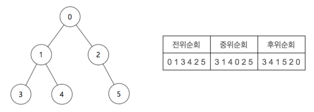

# 트리순회결과 출력

### 문제

----------

루트가 0인 이진트리가 주어질 때, 이를 전위순회, 중위순회, 후위순회한 결과를 각각 출력하는 프로그램을 작성하시오. 아래 그림은 이진트리의 예제와, 이 이진트리를 전위순회, 중위순회, 후위순회 한 결과를 나타낸다.



### 입력

----------

첫 번째 줄에 트리의 노드 개수 n이 주어진다. ( 1 ≤ n ≤ 100 ) 두 번째 줄부터 트리의 정보가 주어진다. 각 줄은 3개의 숫자 a, b, c로 이루어지며, 그 의미는 노드 a의 왼쪽 자식노드가 b, 오른쪽 자식노드가 c라는 뜻이다. 자식노드가 존재하지 않을 경우에는 -1이 주어진다.

### 출력

----------

첫 번째 줄에 전위순회, 두 번째 줄에 중위순회, 세 번째 줄에 후위순회를 한 결과를 출력한다.

### 예제 입력

```
6
0 1 2
1 3 4
2 -1 5
3 -1 -1
4 -1 -1
5 -1 -1
```

### 예제 출력

```
0 1 3 4 2 5
3 1 4 0 2 5
3 4 1 5 2 0
```

### 코드

```java
import java.util.Scanner;
public class Main{
    public static void main(String[] args){

      // Please Enter Your Code Here
      Scanner sc = new Scanner(System.in);
      int n = Integer.parseInt(sc.nextLine());
      
      Node array[] = new Node[200];
      Tree tree = new Tree();
      
      //set Node
      for(int i=0; i<n; i++){
        String inputs[] = sc.nextLine().split(" ");
        int value = Integer.parseInt(inputs[0]);
        int leftValue = Integer.parseInt(inputs[1]);
        int rightValue = Integer.parseInt(inputs[2]);
        
        Node node = null;
        Node leftNode = null;
        Node rightNode = null;
        
        if(value != -1){
          //Node
          if(array[value] == null){
            node = new Node(value);  
            array[value] = node;
          }else{
            node = array[value];
          }  
        }
        
        if(leftValue != -1){
          //leftNode
          if(array[leftValue] == null){
            leftNode = new Node(leftValue);
            array[leftValue] = leftNode;
          }else{
            leftNode = array[leftValue];
          }  
        }
        
        if(rightValue != -1){
          //rightNode
          if(array[rightValue] == null){
            rightNode = new Node(rightValue);  
            array[rightValue] = rightNode;
          }else{
            rightNode = array[rightValue];
          }  
        }
                
        node.setLeft(leftNode);
        node.setRight(rightNode);
        
        //root node setting
        if(i==0){ 
          tree.setRoot(node);
        }
        
      } // for end
      
      
      //순회결과 출력
      prefixCircle(tree.getRoot());
      System.out.println("");
      middleCircle(tree.getRoot());
      System.out.println("");
      postCircle(tree.getRoot());
      
    }
    
    
    // Root - L - R
    public static void prefixCircle(Node rootNode){
      
      //Exit
      if(rootNode == null){
        return;
      }
      
      //root
      System.out.print(rootNode.getValue()+" ");
      
      //left
      prefixCircle(rootNode.getLeft());
      
      //right 
      prefixCircle(rootNode.getRight());
    }
    
    // L - Root - R
    public static void middleCircle(Node rootNode){
      
      //Exit
      if(rootNode == null){
        return;
      }
      
      //left
      middleCircle(rootNode.getLeft());
      
      //root
      System.out.print(rootNode.getValue()+" ");
      
      //right 
      middleCircle(rootNode.getRight());
    }    

    // L - R - Root
    public static void postCircle(Node rootNode){
      
      //Exit
      if(rootNode == null){
        return;
      }
      
      //left
      postCircle(rootNode.getLeft());
      
      //right 
      postCircle(rootNode.getRight());
      
      //root
      System.out.print(rootNode.getValue()+" ");
    }       
}

class Node{
  int value;
  Node left;
  Node right;
  
  public Node(int value){
    this.value = value;
    this.left = null;
    this.right = null;
  }
  
  int getValue(){
    return this.value;
  }

  void setLeft(Node leftNode){
    this.left = leftNode;
  }
  
  Node getLeft(){
    return this.left;
  }
  
  void setRight(Node rightNode){
    this.right = rightNode;
  }  
  
  Node getRight(){
    return this.right;
  }
}

class Tree{
  
  Node root;
  
  public Tree(){
  
  }
  
  void setRoot(Node rootNode){
    this.root = rootNode;
  }
  
  Node getRoot(){
    return this.root;
  }
}
```